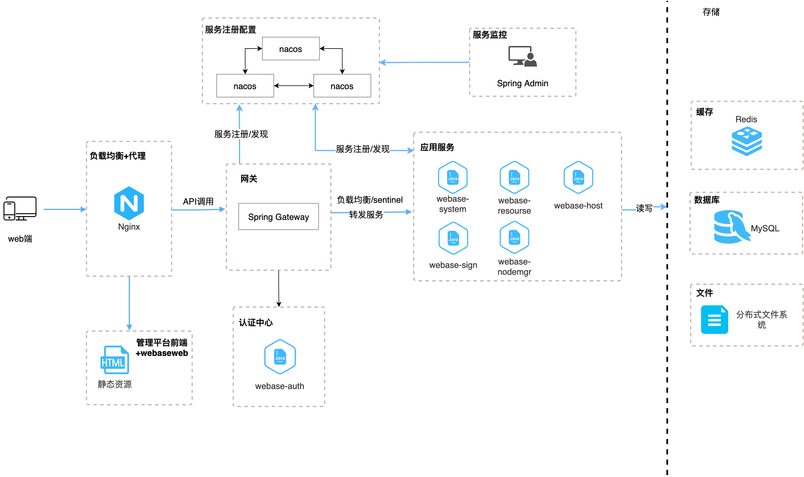

# 快速搭建微服务版本
## 简介

一键部署微服务版本可以快速搭建WeBASE微服务版本管理台环境。包括微服务基础服务(mysql、redis、文件存储、nacos、seata、gateway、auth、system、resource、host-mgr、nginx)、微服务管理平台web端、签名服务子系统（WeBASE-Sign）、节点管理子系统（WeBASE-Node-Manager）。其中，链和节点的搭建可以使用微服务管理平台上的可视化搭建链相关的功能完成，支持bcos3.4.0版本的可视化部署。

本脚本支持linux系统，暂不支持mac和windows系统。推荐使用CentOS 7.2+, Ubuntu 16.04及以上版本。


部署架构如下，目前部署的脚本中未启动服务监控，实际环境中根据可以需求，自行启用相关的服务，也可以扩展启动skywalking、消息队列等增强服务。




## 前提条件

| 环境           | 版本                 | 说明                                             |
| -------------- | -------------------- | ------------------------------------------------ |
| Java           | Oracle JDK 8 以上    |                                                  |
| mysql-client   | 根据系统下载对应版本 | 部署脚本中包含了检查和安装该软件，可以不单独安装 |
| maven          | 根据系统下载对应版本 | 部署脚本中包含了检查和安装该软件，可以不单独安装 |
| Docker         | 20.10.0及以上版本    |                                                  |
| Docker-Compose | 1.29.2 及以上版本    |                                                  |

## 部署
微服务版本提供了部署脚本，在本文档的同级目录下的 ./deploy.sh文件中。

部署之前需要检查build方法中的相关参数，按实际情况进行修改：

```
# webase微服务框架代码下载地址
ZIP_URL="https://github.com/QCTC-chain/WeBASE-Micro/archive/refs/heads/main.zip"

# zip压缩包名称
ZIP_FILE="WeBASE-Micro-main.zip"

# 解压后的目录名称
DIR_NAME="WeBASE-Micro-main"
```


可以使用如下命令，一键部署服务：

```
./deploy.sh all -u root -p webase123 -h 127.0.0.1 -P 3306
```

其中的`-u root -p webase123 -h 127.0.0.1 -P 3306`是微服务基础架构中设置的数据库连接相关的参数，如果手动修改了相关基础微服务的数据库配置，则这几个参数也要对应修改。该脚本主要的工作包括：

1. 下载微服务框架基础代码，并使用mvn进行编译构建
2. 启动微服务基础服务
3. 初始化本系统的数据库
4. 启动其余的服务
5. 检查服务的启动状态


也可以自己按以上的顺序，执行相关单独的命令，命令包括：

1. `./deploy.sh build`  : 下载微服务框架基础代码，检查和安装mvn，并使用mvn进行编译构建
2. `./deploy.sh start base`  : 启动微服务基础服务，包括mysql、redis、minio
3. `./deploy.sh init db`  : 初始化本系统的数据库，包括基础服务、配置、seata、主机管理、节点管理和签名服务的数据库创建和数据库表的初始化
4. `./deploy.sh start other`  : 启动本项目其他的服务

### 启动测试

以上步骤执行完之后，即完成了WeBASE微服务版本的部署，浏览器访问对应的ip地址即可进入webase的登录页面。初始账户密码：admin/admin123。

### 配置可视化部署主机的rsa公私钥

本系统默认nacos的配置中设置了部署主机rsa的测试公私钥，为了安全起见，建议生成自己的公私钥，配置到nacos配置中，具体的配置请访问`http://ip:8848/nacos`，然后配置列表中选择prod命名空间，搜索`application-common.yml`配置，修改host-mgr配置下的ssh-rsa和ssh-key。具体的秘钥对生成方法请参考：https://webasedoc.readthedocs.io/zh-cn/latest/docs/WeBASE-Install/visual_deploy.html#id8

## 停止

本系统采用docker进行部署，可以进入docker目录，执行以下命令，停止所有服务：

```
docker-compose down -v
```

